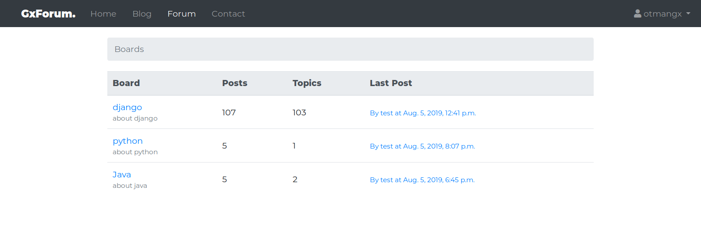
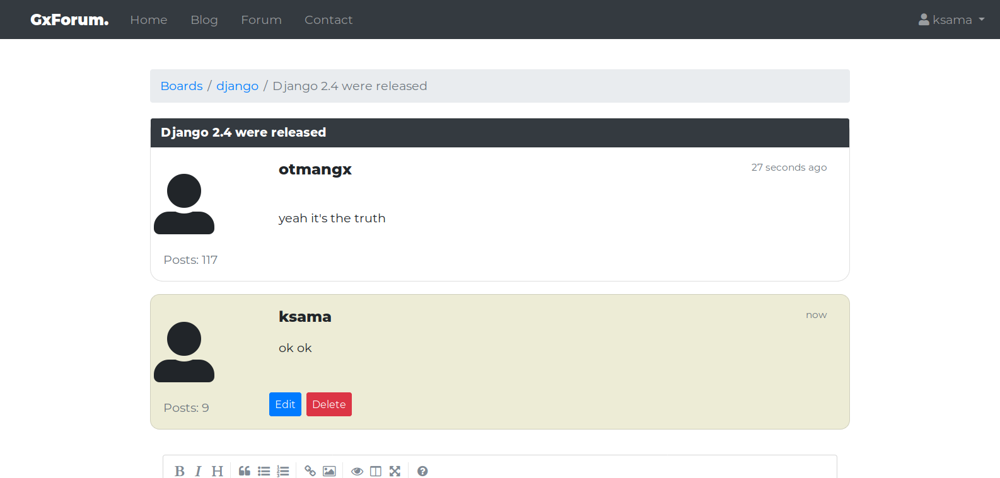

# gxforum




## About
it's a simple website that contains a forum, blog and a contact page
## Installation
Run that command to install the dependencies : (**it'is recommended to install it in a virtualenv**)

`pip install -r requirements.txt`

The project uses postgresql as a database so you can switch to the default sqlite3 database by replacing DATABASES dictionary in gxforum/settings.py with :

```python3
DATABASES = {
    'default': {
        'ENGINE': 'django.db.backends.sqlite3',
        'NAME': os.path.join(BASE_DIR, 'db.sqlite3'),
    }
}
```
after that you can create the database by :

```
python manage.py makemigrations
python manage.py migrate
```
and finally start the developement server :
```
python manage.py runserver
```
